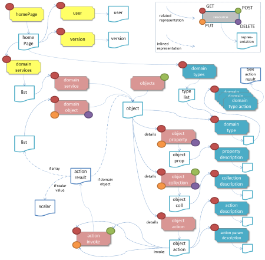

The Restful Objects specification defines a set of RESTful resources, and corresponding JSON representations, for accessing and manipulating a domain object model. The current version of the spec is **v1.0.0**.

The spec defines a uniform interface to the domain objects. This uniformity is expressed in terms of the format of URLs, use of standard HTTP methods, standard and custom HTTP headers, standard HTTP return codes, use of JSON representations, the concept of a representation type to allow the dynamic handling by clients, standard attributes within JSON representations, and standard representation of links between representations.

The Restful Objects spec is at a higher-level of abstraction than, say, the JAX-RS specifications for Java platform, or the WCF specifications on .NET. Specifically, the domain objects that it exposes as resources are thought of in similar terms to UML, in that they consist of properties (holding either a scalar value or reference), collections (holding a vector of references), and actions (whereby the object can execute business logic).

Restful Objects is agnostic as to the nature of the server-side state that it exposes, in that it may be used either to expose domain entities (`Customer`, `Order`, `Product`) or may be used to expose use cases/commands (`CheckIntoFlight`, `CancelOrder`).

Finally, the spec is designed to support clients that use HATEOAS (hypertext as the engine of application state) with opaque URI values, and also those that prefer to use templated URIs.

